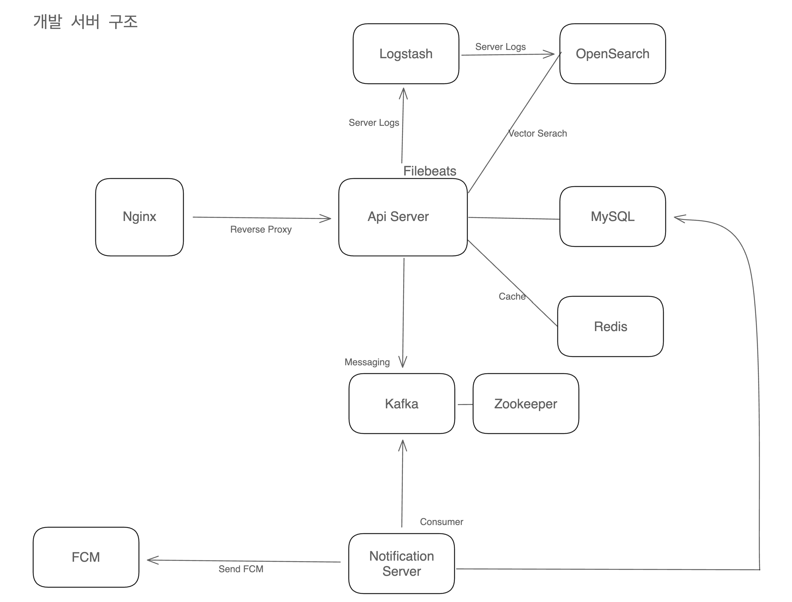

## 개발 환경 배포 정보


## 고려사항
- 단일 EC2 환경 고려 : SW 마에스트로 활동이 끝나도 유지보수가 가능하기 위해 단일 EC2 환경의 Docker 기반으로 구성 되어야 함.
- 개인 랩탑 개발 시 활용 가능 
  - 추후 시스템 구성 요소가 추가되도 문서만 보고 적용 및 실행이 가능하도록 Readme에 잘 적혀있어야 함
  - 개인 랩탑에서 원활하게 실행하기 위해 주입되는 환경 값들의 변수적용이 되어야 함

## 시스템 구성도




### 도커 Service Name / Port(default) 현황
- service name이 static으로 compose에 적용됐기 때문에 따로 Readme에 테이블로 명시
- port 같은 경우 컨테이너 내부 포트는 기본 시스템 포트(ex, MySQL -> 3306, Spring Boot-> 8080) 사용 
- 컨테이너 외부 포트의 경우 env 값으로 명시 없으면 default 값을 compose에 static 명시, **아래 표에 표시함**
  -  외부 포트를 받거나 명시하는 이유는 로컬에 실행시 기존의 시스템과 충돌을 방지하기 위함 
- 해당 부분은 추후 서비스명:포트가 아닌 다른 표현 방식이 사용될 경우 없어질 예정

<table>
    <tr>
        <th>서비스 종류</th>
        <th>docker service 이름</th>
        <th>docker 컨테이너 외부 포트 </th>
    </tr>
    <tr>
        <td>
            스프링 WAS 
        </td>
        <td>
            jabiseo-was
        </td>
        <td>
            8081
        </td>
    </tr>
    <tr>
        <td>
            MySQL DB 
        </td>
        <td>
            jabiseo-mysql
        </td>
        <td>
            3307
        </td>
    </tr>
    <tr>
        <td>
            Redis
        </td>
        <td>
            jabiseo-redis
        </td>
        <td>
            7380
        </td>
    </tr>
    <tr>
        <td>
            Nginx
        </td>
        <td>
            webserver-nginx
        </td>
        <td>
            80
        </td>
    </tr>
    <tr>
        <td>
            프로메테우스
        </td>
        <td>
            jabiseo-prometheus
        </td>
        <td>
            9090
        </td>
    </tr>
    <tr>
        <td>
            그라파나
        </td>
        <td>
            jabiseo-grafana
        </td>
        <td>
            4000
        </td>
    </tr>
    <tr>
        <td>
            카프카
        </td>
        <td>
            kafka
        </td>
        <td>
            29092 
        </td>
    </tr>
    <tr>
        <td>
            주키퍼
        </td>
        <td>
            zookeeper
        </td>
        <td>
            22181
        </td>
    </tr>
</table>

---

## 실행
- 주의 : nginx의 경우 로컬을 고려하지 않음 사용 x

1. 사전 준비(1) - docker network 생성
```shell
docker network create jabiseo-dev
```

2. 사전 준비(2) - .env 환경변수 파일 생성
  - .env.example 파일 카피 후 .env파일을 /developcompose/.env 위치에 생성
  - 적절한 값 셋팅

3. 각 파일 별로 실행

```shell
docker compose -f ./{종류별}/docker-compose.yml up -d

# or
 
cd ./{종류별} # 디렉토리 이동
docker compose up -d
```

4. 종료
```shell
docker compose -f ./{종류별}/docker-compose.yml down

# or
 
cd ./{종류별} # 디렉토리 이동
docker compose down
```

## 폴더별 설명

### 데이터베이스
- MySQL, Redis 간단 셋팅

### Nginx
- default.conf : 환경 설정 파일
- init-letsencrpyt.sh  ssh 키 파일 생성 스크립트 파일(nginx 공식 깃헙 제공, 서비스 명 수정됨)

### 모니터링
- 프로메테우스, 그라파나 설정
- 현재 Local(인텔리제이) WAS를 host.docker.internal:9292 경로로 직접 가져옴.(수정 예정)

### elk
- Filebeat, Logstash 설정
- filebeat.yml: filebeat 설정 파일
- logstash.conf: logstash 설정 파일, OpenSearch 관련된 변수는 노션 참고

### kafka/single
- 단일 노드로 구성된 카프카 설정
- Local,dev 개발 환경에서 테스트 용도로 사용
- 시크릿 변수는 존재 X

```shell
$ docker compose exec kafka bash // 접속
$ kafak-topics --bootstrap-server kafka:9092 --create --topic ${토픽} // 옵션 추가  가능
$ kafka-topics --bootstrap-server kafka:9092 --describe --topic ${토픽} // 확인 가능

...
```
